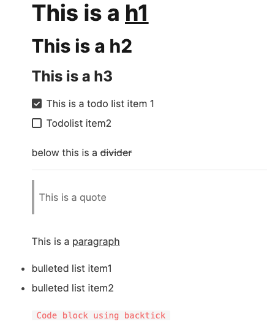
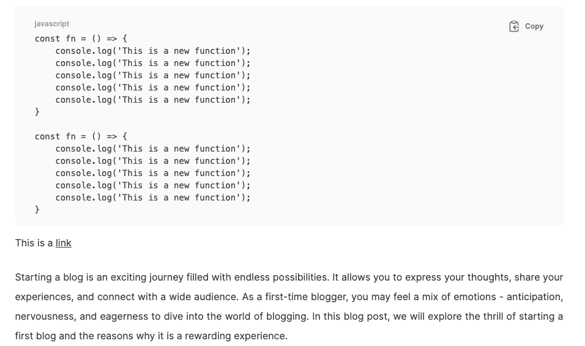
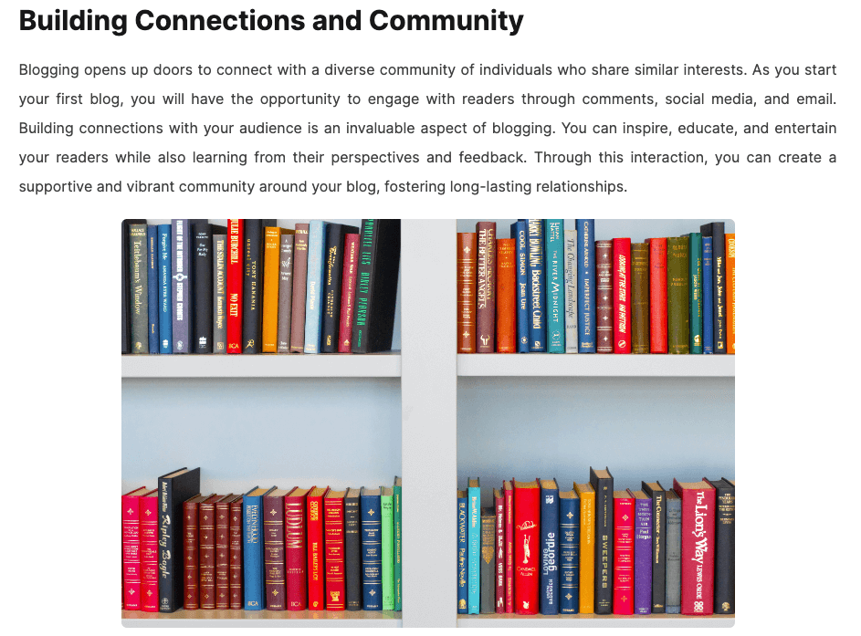
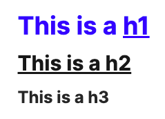

# Notion to JSX

A super fast plugin that converts your notion page to corresponding JSX with customizable styles. Types are included.

## Installation

```bash
npm install notion-jsx
```

## Usage

### Fetching your Notion page

Each notion page is made of multiple blocks, therefore in order to retrieve the blocks of a page, you will need your Notion page's id. You can copy the page id from the page's link.

**For example:**

If your Notion page's link is, `https://www.notion.so/myworkspace/How-to-Use-Notion-as-a-CMS-767de912c4c942509a7956d54ef0db7a`

Then the page id would be, `767de912c4c942509a7956d54ef0db7a`

Please refer to Notion's [official documentation](https://developers.notion.com/reference/get-block-children) to know how you use their APIs or JavaScript SDK.

**If you are using the Notion JavaScript SDK, you would be doing something like this:**

```typescript
/**
 * A sample function to get blocks using the Notion JavaScript SDK
 * */
const getBlocks = () => {
  const blocks = await Promise.all(
    pageIds.map((page_id: string) =>
      notion.blocks.children.list({
        block_id: page_id,
      })
    )
  );

  return blocks;
};
```

### Using notionJSX to parse the blocks to JSX

You can pass blocks directly to the `generateJSX()` function on `notionJSX`.

```typescript
import notionJSX from 'notion-jsx';

const MyComponent = () => {
  const blocks = getBlocks();
  const elements = notionJSX.generateJSX(blocks) as ReactElement[];

  return (
    <div className="my-class">
      {elements?.map((element: ReactElement, index: number) => {
        return React.createElement(
          element.type,
          {
            key: element.key || index,
            className: element.props.className,
            ...element.props,
          },
          element.props.children
        );
      })}
    </div>
  );
};
```

### Supported Notion blocks

** The following Notion blocks are currently supported:**

- heading_1
- heading_2
- heading_3
- paragraph
- bulleted_list_item
- quote
- to_do
- code
- divider
- image

<div align='center'>



</div>

### Passing custom styles

You can pass custom styles for each supported element. If you don't pass your own styles, the default styles will be applied.

<div align='center'>

</div>

```typescript
const options = {
  styles: {
    heading_1: { color: 'blue' },
    heading_2: { textDecoration: 'underline' },
  },
};
const elements = notionJSX.generateJSX(blocks, options) as ReactElement[];
```

### Rendering generated JSX on the DOM

To generate JSX, you can use the generateJSX function and pass the blocks and options as arguments

```typescript
<div className="my-class">
  {elements?.map((element: ReactElement, index: number) => {
    return React.createElement(
      element.type,
      {
        key: element.key || index,
        className: element.props.className,
        ...element.props,
      },
      element.props.children
    );
  })}
</div>
```

## Contributing

NotionJSX is completely free and open source, please feel free to contribute if you like what we are doing.

### How to contribute?

#### 1. Fork the repository

Click on the "Fork" button at the top right corner of this repository. This will create a copy of the project in your GitHub account.

#### 2. Clone the Repository:

Clone the forked repository to your local machine using the git clone command.

```bash
git clone https://github.com/your-username/notion-jsx.git
```

#### 3. Create a Branch:

Create a new branch for your contribution.

```bash
git checkout -b feature/new-feature
```

#### 4. Make Changes:

Make your desired changes and improvements to the codebase.

#### 5. Commit Changes:

Commit your changes with a descriptive commit message.

```bash
git commit -m "feat: your feature description"
```

#### 6. Push Changes:

Push your changes to your forked repository.

```bash
git push origin feature/new-feature
```

#### 7. Submit a Pull Request:

Open a pull request from your forked repository to the main repository.

### Issues and Feature Requests

If you encounter issues or have ideas for new features, feel free to open an issue on the issue tracker.

Thank you for making NotionJSX even better! ❤️
